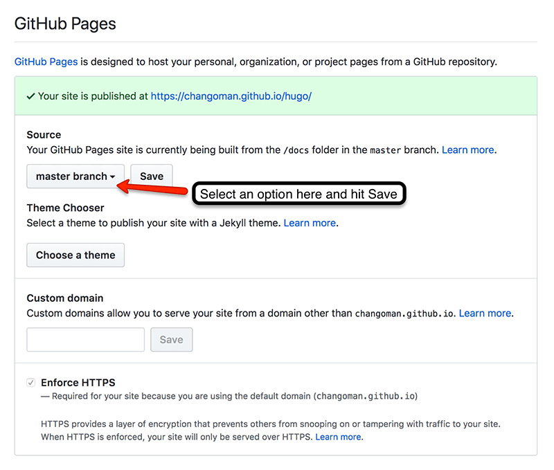

So you've just put the finishing touches on your [static website](https://codebushi.com/modern-static-website-portfolio/) and it's time to share it with the world. The good news is, there are plenty of great hosting solutions out there to help simplify the process. Deploying a modern static site has become extremely fast, easy, and completely free! Best of all, these solutions all have caching and a content delivery network (CDN) built in for optimal performance.

If you're launching a personal website or anything important, I'd highly recommend purchasing a domain name. This would be the only cost you'd incur in this process, but domain names are only about $10 - $15 for an entire year. If you're just experimenting or don't care about your url, the hosting solutions below will give you a subdomain to use for free. The difference basically boils down to: `yoursite.com` vs `yoursite.netlify.com`.

I recently used [Namecheap](https://namecheap.pxf.io/c/1220989/386521/5618) because the domain came with free Whois privacy, which is important if you don't want to get spammed by advertisers. Pretty good deal considering that other places charge $5 - $10 just for the privacy option.

<h3 class="mt-5 mb-3">GitHub Pages</h3>

[GitHub Pages](https://pages.github.com/) are great because they allow you to host your site directly from a GitHub repository. Once the initial setup is complete, you can quickly deploy every time you commit changes to your repository. You'll choose to publish on GitHub Pages with either a User Site or a Project Site. With a User Site, you just need to create a new repository using your username. The repo name should be: `username.github.io`.

For example, my GitHub username is ChangoMan, so my new repository would be called: [changoman.github.io](https://github.com/ChangoMan/changoman.github.io/). Now I just need to create a new `index.html` file and commit it to that repository, and the site will be live up on https://changoman.github.io/. Your static site generator should have produced a compiled folder (usually called `/public`) after the build process, so you'll need to commit the contents to your repository.

The second option is with a Project Site, and it works in a similar way. You can choose any name you want for your repository, or even use an existing one. Once your static site is committed to the repo, head into the `Settings` tab and scroll down to see the GitHub Pages section.



Select the `master branch` as the source and your site will be live at: **https://_username_.github.io/_repository_**. Alternatively, you can select `master branch /docs folder` and GitHub Pages will ignore everything in your master branch and only deploy the stuff in the `/docs` folder.  Since the static site generator will probably output a folder called `/public`, you'll need to configure it and change the name from `/public` to `/docs` before committing.

For example, the repo: https://github.com/ChangoMan/hugo contains a Hugo static site template. Notice the folder in there called `/docs`, which contains the final site files. Normally this folder would be called `/public` but I've configured Hugo and changed the output folder name, this is done in the [config.toml](https://github.com/ChangoMan/hugo/blob/master/config.toml "config.toml") file.

The `/docs` method is useful if you want to keep track of both the static site template and the final compiled site. There are plenty of [GitHub guides](https://help.github.com/categories/github-pages-basics/) for more advanced techniques.

<h3 class="mt-5 mb-3">Custom Domain Names</h3>

If the free GitHub subdomain isn't ideal, you can use your own domain as I've mentioned earlier. Head over to [Namecheap](https://namecheap.pxf.io/c/1220989/386521/5618) if you're looking for a new domain. Once you have your domain, navigate to the `Settings` tab for your GitHub repository and enter your custom domain in the Pages section. Next, you'll have to configure your `ALIAS`, `ANAME`, or `A`record with your DNS provider. This step will vary depending on where you've purchased your domain, refer to [this guide](https://help.github.com/articles/setting-up-an-apex-domain/) for more details.

As a side note, you'll get access to a free SSL certificate when using a GitHub subdomain, but you'll lose the SSL when switching to a custom domain. This is also true for Surge.sh, which is another hosting option we'll explore below. Having your site served from `https` is important because Google strongly favors this for SEO rankings. If you want SSL with a custom domain, you can set up a free [Cloudflare account](https://www.cloudflare.com/ssl/) and let Cloudflare handle your DNS record.

<h3 class="mt-5 mb-3">Surge.sh</h3>

I really like Surge.sh because of how fast and easy it is to set up and deploy. You'll need to have Node.js and npm installed on your machine to start using Surge. From your root project folder, make sure you've generated your final build folder

```bash
# Go into your generated folder, called public/ in this case
cd public/

# Install Surge globally on your machine
npm  install  --global  surge
# Create an account, you can do this from the terminal

# Deploy all the contents of the current folder.
surge
# Verify your project path and choose a subdomain

# Create a CNAME file so Surge will deploy to the same domain every time
echo subdomain.surge.sh > CNAME
```

Boom, that's it. Everything can be done from the terminal with just a few commands. You can choose to use the randomly generated subdomain or edit your own during the deploy process. By default, Surge will want to generate a new subdomain every time you deploy. Adding that `CNAME` file will tell Surge to remember the domain you picked.

As with GitHub Pages, you can set up a [custom domain](http://surge.sh/help/adding-a-custom-domain), but it won't come with a SSL certificate. You can remedy this with a free Cloudflare account just as before.

<h3 class="mt-5 mb-3">Netlify <small>(Personal Favorite)</small></h3>

So far, we've discussed two great options for hosting but they both have similar drawbacks. The first is that custom domains do not come with a SSL certificate. As mentioned before, having your site served from `https` helps with Google SEO rankings and is pretty important. With [Netlify](https://www.netlify.com/), you'll get free SSL with your custom domain! That's one less thing you'll need to worry about when hosting your final project.

The second drawback is dealing with a build process. With static site generators, you'll need to run a `build` command anytime you make a change or deploy. This can get pretty tedious, but with Netlify's [Continuous Deployment](https://www.netlify.com/docs/continuous-deployment/), we can skip this build step altogether. Once you sign up and integrate your GitHub account, all you have to do choose which build command to run and which folder to deploy. Anytime you make a change and make a commit, Netlify will detect this and run the build process for you!

Netlify also comes with some [great features](https://www.netlify.com/features/), such as free form handling and [Webhooks](https://www.netlify.com/docs/webhooks/) for easier deployment. It has definitely become my favorite choice when hosting static websites, check out these great [video tutorials](https://www.youtube.com/playlist?list=PLzlG0L9jlhEPMR8haUPkxj2hJ_3jh5qa6) for more information.
